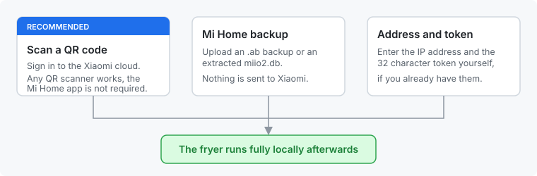
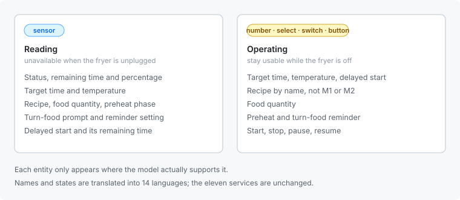

# Xiaomi Heißluftfritteuse

Home-Assistant-Integration für Heißluftfritteusen von Xiaomi, Careli, Silencare
und Viomi. Läuft vollständig im eigenen Netz — die Cloud wird nur einmal
gebraucht, um den Geräte-Token zu holen, und lässt sich auch ganz umgehen.

**[English version](README.md)**

---

## Einrichten

Ein Xiaomi-Gerät antwortet nur dem, der seinen Token kennt. Es gibt drei Wege
dorthin, und die Integration fragt gleich zu Beginn, welchen du nehmen willst.

**QR-Code scannen.** Die Integration meldet sich an der Xiaomi-Cloud an und
liest den Token aus deinem Konto, ohne dass du etwas abtippen musst. Es
funktioniert jeder QR-Scanner — die Handykamera öffnet die Anmeldeseite im
Browser — und die Mi-Home-App natürlich auch.

**Aus einem Mi-Home-Backup.** Lade ein Android-Backup (`.ab`), eine bereits
entpackte `miio2.db` oder die Datenbank aus einem iOS-Backup hoch. Nichts
verlässt dabei dein Netz. Praktisch, wenn du dich nicht anmelden möchtest oder
falls die Anmeldung irgendwann nicht mehr funktioniert.

**Von Hand.** Wenn du Adresse und den 32-stelligen Token schon hast, trage sie
direkt ein.

Welchen Weg du auch nimmst: Der Token wird einmal gespeichert, danach läuft
alles lokal über das miIO-Protokoll.

---

## Was du bekommst

Entitäten entstehen nur dort, wo das Modell sie auch unterstützt — eine
Fritteuse ohne Startverzögerung bekommt also kein solches Feld.

Neben den Entitäten decken elf Dienste dasselbe für Automationen ab:
`start`, `stop`, `pause`, `resume`, `start_custom`, `preheat`, `recipe_id`,
`food_quanty`, `appoint_time`, `target_time` und `target_temperature`.

### Sprachen

Entitätsnamen, deren Zustände und der komplette Einrichtungsdialog sind in
vierzehn Sprachen übersetzt:

Chinesisch (traditionell) · Dänisch · Deutsch · Englisch · Französisch ·
Griechisch · Italienisch · Niederländisch · Polnisch · Portugiesisch ·
Russisch · Schwedisch · Spanisch · Tschechisch

Das schließt die Werte selbst ein: Im Dashboard steht *Gart* und *Kein Wenden
nötig* statt `Cooking` und `NotTurnPot`. Rezepte erscheinen als *Pommes frites*
oder *Hähnchenflügel* statt `M1` und `M2`, sofern die Rezept-Slots des Modells
bekannt sind.

---

## Unterstützte Geräte

| Name | Modell |
|------|--------|
| Mi Smart Air Fryer | `careli.fryer.maf01` |
| Mi Smart Air Fryer | `careli.fryer.maf02` |
| Mi Smart Air Fryer 3.5L | `careli.fryer.maf03` |
| Xiaomi Smart Air Fryer Pro 4L | `careli.fryer.maf05a` |
| Mi Smart Air Fryer | `careli.fryer.maf06` |
| Mijia Smart Air Fryer 4.5L | `careli.fryer.maf06a` |
| Mijia Smart Air Fryer 4.5L | `careli.fryer.maf06b` |
| Mi Smart Air Fryer 3.5L Global | `careli.fryer.maf07` |
| Mijia Smart Air Fryer 5.5L | `careli.fryer.maf07c` |
| Youban Mijia Smart Air Fryer 6.5L | `careli.fryer.maf09a` |
| Xiaomi Smart Air Fryer 6.5L | `careli.fryer.maf10` |
| Mi Smart Air Fryer EU 6.5L | `careli.fryer.maf10a` |
| Upany Air Fryer YB-02208DTW | `careli.fryer.ybaf01` |
| Youban Smart Air Fryer 2208DTW | `careli.fryer.ybaf02` |
| Youban KitchenMi Smart Air Fryer 6007WA | `careli.fryer.ybaf03` |
| Youban KitchenMi Smart Air Fryer 6007WAB | `careli.fryer.ybaf04` |
| Xiaomi Smart Air Fryer 4.5L Global | `xiaomi.fryer.maf14` |
| Xiaomi Smart Air Fryer 4.5L | `xiaomi.fryer.maf15` |
| Xiaomi Smart Air Fryer | `xiaomi.fryer.maf16` |
| Xiaomi Smart Air Fryer | `xiaomi.fryer.maf07d` |
| Silencare Air Fryer 1.8L | `silen.fryer.sck501` |
| Silencare Silent Smart Air Fryer | `silen.fryer.sck505` |
| Viomi Smart Air Fryer Pro 6L | `viomi.fryer.v3` |
| Mi Smart Air Fryer | `miot.fryer.534` |

Die Eigenschafts-Zuordnungen stammen aus den veröffentlichten MIoT-Spezifikationen,
sie sind nicht geraten. Fehlt dein Modell, öffne ein Issue mit dem Modellnamen —
in der Mi-Home-App unter den Geräteinformationen zu finden — und einem Link zur
Spezifikation auf [miot-spec.org](https://miot-spec.org).

---

## Installation

**Über HACS.** HACS → Integrationen → ⋯ → Benutzerdefinierte Repositories →
`sphings79/XiaomiAirFryer`, Kategorie *Integration*. Installieren, dann Home
Assistant neu starten.

**Von Hand.** Den Ordner `custom_components/xiaomi_airfryer` in den
Konfigurationsordner kopieren und neu starten.

Danach unter Einstellungen → Geräte & Dienste → Integration hinzufügen →
*Xiaomi AirFryer* einrichten.

---

## Hinweise

**Die Fritteuse hängt zwischen den Einsätzen meist nicht am Strom.** Sensoren
melden sich dann als nicht verfügbar und kommen von selbst zurück, sobald das
Gerät wieder erreichbar ist — ohne Neustart. Die Bedienelemente bleiben nutzbar
und zeigen die zuletzt bekannte Einstellung, damit das Dashboard nicht voller
grauer Zeilen steht.

**Der Stromverbrauch lässt sich nicht auslesen.** Keine dieser Fritteusen misst
ihn; in ihren MIoT-Spezifikationen kommt keine einzige elektrische Größe vor.
Echte Zahlen gibt es nur über eine Messsteckdose.

**Die Rezepte stecken in der App, nicht im Gerät.** Das Gerät meldet, welcher
Slot gewählt ist (`M1`, `M2`, …), aber nicht, was darin liegt; sein
`recipe_name` bleibt auf einem Platzhalter stehen. Die Slot-Namen in dieser
Integration wurden ermittelt, indem an einem Gerät mitgelesen wurde, während
nacheinander seine Rezepte ausgewählt wurden. Beiträge für weitere Modelle sind
willkommen — die Tabelle ist pro Modell angelegt, unbekannte Slots werden
unverändert durchgereicht.

---

## Über dieses Projekt

Dies ist eine eigenständig gepflegte Fortführung von
[tsunglung/XiaomiAirFryer](https://github.com/tsunglung/XiaomiAirFryer), wo seit
November 2024 kein Issue mehr beantwortet wurde. Sie bringt eine funktionierende
Cloud-Anmeldung mit, nachdem die ursprüngliche nicht mehr lief, einen neu
gebauten Aktualisierungspfad, Übersetzungen, Bedienelemente und Korrekturen für
eine Reihe lange offener Meldungen.

Ursprüngliche Arbeit © 2021 tsunglung, MIT-lizenziert. Die Implementierung des
miIO-Protokolls stammt aus
[python-miio](https://github.com/rytilahti/python-miio) von Teemu Rytilahti. Die
Cloud-Anmeldung folgt dem Ansatz von
[Xiaomi-cloud-tokens-extractor](https://github.com/PiotrMachowski/Xiaomi-cloud-tokens-extractor)
von Piotr Machowski, ebenfalls MIT-lizenziert.
