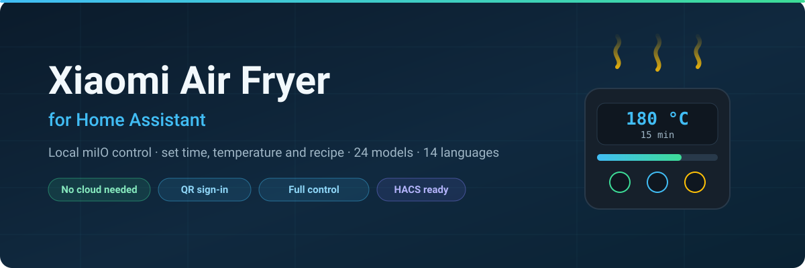
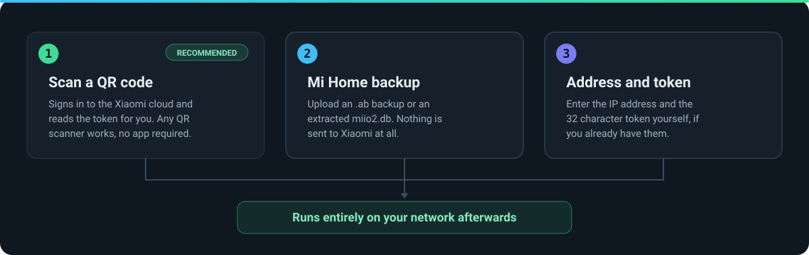
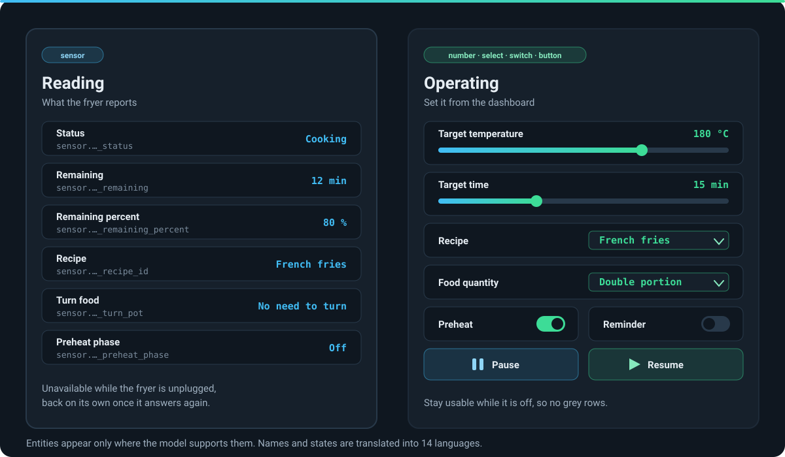

<div align="center">
  

  # Xiaomi Heißluftfritteuse — lokale Steuerung für Home Assistant

  **Zeit, Temperatur und Rezept der Xiaomi-Heißluftfritteuse direkt aus Home Assistant setzen.**
  Läuft über das lokale miIO-Protokoll; die Cloud wird nur einmal gebraucht, um den Geräte-Token zu holen, und lässt sich auch ganz umgehen.

  [](https://hacs.xyz)
  [](https://github.com/sphings79/XiaomiAirFryer/releases)
  [](https://www.home-assistant.io)
  [](LICENSE)

  [](https://my.home-assistant.io/redirect/hacs_repository/?owner=sphings79&repository=XiaomiAirFryer&category=integration)

  [English](README.md) &#183; **Deutsch**

  Wenn dir das Gefrickel erspart bleibt, hilft ein ⭐ auf dem Repository anderen beim Finden.
</div>

---

## Inhalt

- [Was die Integration macht](#was-die-integration-macht)
- [Welche Entitäten du bekommst](#welche-entitäten-du-bekommst)
- [Unterstützte Modelle](#unterstützte-modelle)
- [Installation](#installation)
- [Einrichten](#einrichten)
- [Beispiele für Automationen](#beispiele-für-automationen)
- [Sprachen](#sprachen)
- [Fehlersuche](#fehlersuche)
- [Häufige Fragen](#häufige-fragen)
- [Credits](#credits)
- [Haftungsausschluss](#haftungsausschluss)
- [Mitmachen](#mitmachen)
- [Lizenz](#lizenz)

---

## Was die Integration macht

Heißluftfritteusen von Xiaomi, Careli, Silencare und Viomi sprechen das lokale
**miIO-Protokoll** — dasselbe, das die Mi-Home-App im eigenen Netz benutzt. Diese
Integration spricht direkt mit ihnen: Sobald der Geräte-Token bekannt ist, verlässt nichts
mehr dein Netz.

Du bekommst den Zustand des Geräts als Sensoren — was es gerade tut, wie lange noch,
welches Rezept gewählt ist — **und du kannst es bedienen**: Temperatur einstellen, Rezept
wählen, starten und pausieren, aus dem Dashboard oder einer Automation heraus.



---

## Welche Entitäten du bekommst



### Zum Ablesen

| Entität | Beispiel | Anmerkung |
|---|---|---|
| `sensor.<gerät>_status` | `Gart` | In deiner Sprache |
| `sensor.<gerät>_restzeit` | `12` min | Verbleibende Minuten |
| `sensor.<gerät>_restzeit_in_prozent` | `80` % | Passt gut zu Timer-Karten |
| `sensor.<gerät>_zielzeit` | `15` min | |
| `sensor.<gerät>_zieltemperatur` | `180` °C | |
| `sensor.<gerät>_rezept_id` | `Pommes frites` | Benannt, wo die Slots bekannt sind |
| `sensor.<gerät>_fullmenge` | `Doppelte Portion` | |
| `sensor.<gerät>_vorheizphase` | `Aus` | |
| `sensor.<gerät>_wenden` | `Bitte wenden` | Aufforderung vom Gerät |
| `sensor.<gerät>_startverzogerung_restzeit` | `0` min | Zeit bis zur Startvorwahl |

### Zum Bedienen

| Entität | Typ | Wofür |
|---|---|---|
| `number.<gerät>_zieltemperatur` | number | 40–200 °C |
| `number.<gerät>_zielzeit` | number | 1–1440 Minuten |
| `number.<gerät>_startverzogerung` | number | Startvorwahl in Minuten |
| `select.<gerät>_rezept_id` | select | Rezept über den Namen wählen |
| `select.<gerät>_fullmenge` | select | Einfach, doppelt, halb, voll |
| `switch.<gerät>` | switch | Garen starten und abbrechen |
| `switch.<gerät>_vorheizen` | switch | Vor dem Garen vorheizen |
| `switch.<gerät>_wende_erinnerung` | switch | Erinnerung zum Wenden |
| `button.<gerät>_pausieren` | button | Pausieren |
| `button.<gerät>_fortsetzen` | button | Fortsetzen |

Elf Dienste decken dasselbe für Automationen ab: `start`, `stop`, `pause`, `resume`,
`start_custom`, `preheat`, `recipe_id`, `food_quanty`, `appoint_time`, `target_time` und
`target_temperature`.

> Die Entity-IDs richten sich nach deiner Home-Assistant-Sprache, weil Home Assistant sie
> aus dem übersetzten Entitätsnamen bildet. Auf einer englischen Instanz heißt es
> `sensor.<gerät>_target_temperature`.

---

## Unterstützte Modelle

Vierundzwanzig Modelle. Die Zuordnung der Eigenschaften stammt aus den **veröffentlichten
MIoT-Spezifikationen**, sie ist nicht geraten — deshalb kann die Tabelle auch genau sagen,
was welches Modell kann.

| Modell | ID | Zeit | Temp. | Vorwahl | Menge | Vorheizen | Rezeptnamen |
|---|---|---|---|---|---|---|---|
| Mi Smart Air Fryer | `careli.fryer.maf01` | ✅ | ✅ | ✅ | ✅ | ✅ | — |
| Mi Smart Air Fryer | `careli.fryer.maf02` | ✅ | ✅ | ✅ | ✅ | ✅ | — |
| Mi Smart Air Fryer 3.5L | `careli.fryer.maf03` | ✅ | ✅ | ✅ | ✅ | ✅ | — |
| Xiaomi Smart Air Fryer Pro 4L | `careli.fryer.maf05a` | ✅ | ✅ | ✅ | ✅ | ✅ | ✅ |
| Mi Smart Air Fryer | `careli.fryer.maf06` | ✅ | ✅ | ✅ | ✅ | ✅ | — |
| Mijia Smart Air Fryer 4.5L | `careli.fryer.maf06a` | ✅ | ✅ | ✅ | ✅ | ✅ | — |
| Mijia Smart Air Fryer 4.5L | `careli.fryer.maf06b` | ✅ | ✅ | — | — | — | — |
| Mi Smart Air Fryer 3.5L Global | `careli.fryer.maf07` | ✅ | ✅ | ✅ | ✅ | ✅ | — |
| Mijia Smart Air Fryer 5.5L | `careli.fryer.maf07c` | ✅ | ✅ | — | — | — | — |
| Youban Mijia Smart Air Fryer 6.5L | `careli.fryer.maf09a` | ✅ | ✅ | — | — | — | — |
| Xiaomi Smart Air Fryer 6.5L | `careli.fryer.maf10` | ✅ | ✅ | ✅ | ✅ | ✅ | — |
| Mi Smart Air Fryer EU 6.5L | `careli.fryer.maf10a` | ✅ | ✅ | — | — | ✅ | — |
| Upany Air Fryer YB-02208DTW | `careli.fryer.ybaf01` | ✅ | ✅ | — | — | — | — |
| Youban Smart Air Fryer 2208DTW | `careli.fryer.ybaf02` | ✅ | ✅ | ✅ | ✅ | ✅ | — |
| Youban KitchenMi 6007WA | `careli.fryer.ybaf03` | ✅ | ✅ | ✅ | ✅ | ✅ | — |
| Youban KitchenMi 6007WAB | `careli.fryer.ybaf04` | ✅ | ✅ | ✅ | ✅ | ✅ | — |
| Mi Smart Air Fryer | `miot.fryer.534` | ✅ | ✅ | — | — | ✅ | — |
| Silencare Air Fryer 1.8L | `silen.fryer.sck501` | ✅ | ✅ | — | — | — | — |
| Silencare Silent Smart Air Fryer | `silen.fryer.sck505` | ✅ | ✅ | — | — | — | — |
| Viomi Smart Air Fryer Pro 6L | `viomi.fryer.v3` | ✅ | ✅ | — | — | — | — |
| Xiaomi Smart Air Fryer | `xiaomi.fryer.maf07d` | ✅ | ✅ | — | — | — | — |
| Xiaomi Smart Air Fryer 4.5L Global | `xiaomi.fryer.maf14` | ✅ | ✅ | — | — | — | — |
| Xiaomi Smart Air Fryer 4.5L | `xiaomi.fryer.maf15` | ✅ | ✅ | — | — | — | — |
| Xiaomi Smart Air Fryer | `xiaomi.fryer.maf16` | ✅ | ✅ | — | — | — | — |

**Rezeptnamen** heißt: Die Integration weiß, welches Rezept in Slot `M1`, `M2` und so
weiter liegt, und zeigt *Pommes frites* statt `M1`. Das muss pro Modell an einem echten
Gerät ermittelt werden. Beiträge sind sehr willkommen — siehe [Mitmachen](#mitmachen).

Deine Fritteuse fehlt? Öffne eine
[Modell-Anfrage](https://github.com/sphings79/XiaomiAirFryer/issues/new?template=model_request.yml)
mit dem Modellnamen und einem Link zur Spezifikation auf
[miot-spec.org](https://miot-spec.org).

---

## Installation

### Über HACS

[](https://my.home-assistant.io/redirect/hacs_repository/?owner=sphings79&repository=XiaomiAirFryer&category=integration)

Oder von Hand: HACS → Integrationen → ⋯ → Benutzerdefinierte Repositories →
`sphings79/XiaomiAirFryer`, Kategorie *Integration*. Installieren, dann Home Assistant neu
starten.

### Manuell

Den Ordner `custom_components/xiaomi_airfryer` nach `config/custom_components` kopieren
und Home Assistant neu starten.

---

## Einrichten

Einstellungen → Geräte & Dienste → **Integration hinzufügen** → *Xiaomi AirFryer*. Der
Dialog beginnt mit der Wahl zwischen drei Wegen zum Geräte-Token:

**QR-Code scannen.** Die Integration meldet sich an der Xiaomi-Cloud an und liest den
Token aus deinem Konto. Es funktioniert jeder QR-Scanner — die Handykamera öffnet die
Anmeldeseite im Browser — und die Mi-Home-App genauso. Abtippen entfällt.

**Aus einem Mi-Home-Backup.** Lade ein Android-Backup (`.ab`), eine entpackte `miio2.db`
oder die Datenbank aus einem iOS-Backup hoch. Es wird nichts an Xiaomi gesendet.

**Von Hand.** Trage IP-Adresse und den 32-stelligen Token direkt ein.

Vergib der Fritteuse bei der Gelegenheit eine feste IP-Adresse im Router — die Integration
folgt einem Adresswechsel zwar über mDNS, aber eine Reservierung erspart ihr die Mühe.

---

## Beispiele für Automationen

Benachrichtigen, wenn das Garen fertig ist:

```yaml
automation:
  - alias: Heißluftfritteuse ist fertig
    triggers:
      - trigger: state
        entity_id: sensor.kuche_heissluftfritteuse_status
        to: Cooked
    actions:
      - action: notify.mobile_app_handy
        data:
          message: Die Heißluftfritteuse ist fertig.
```

Ans Wenden erinnern:

```yaml
automation:
  - alias: Essen wenden
    triggers:
      - trigger: state
        entity_id: sensor.kuche_heissluftfritteuse_wenden
        to: TurnPot
    actions:
      - action: notify.mobile_app_handy
        data:
          message: Zeit, das Essen zu wenden.
```

Auf eine Temperatur aus einem Helfer vorheizen:

```yaml
script:
  fritteuse_vorheizen:
    sequence:
      - action: number.set_value
        target:
          entity_id: number.kuche_heissluftfritteuse_zieltemperatur
        data:
          value: "{{ states('input_number.fritteuse_temperatur') | int }}"
      - action: switch.turn_on
        target:
          entity_id: switch.kuche_heissluftfritteuse_vorheizen
      - action: switch.turn_on
        target:
          entity_id: switch.kuche_heissluftfritteuse
```

> In den Automationen steht der **Rohwert** (`Cooked`, `TurnPot`), nicht die Übersetzung.
> Home Assistant speichert immer den Rohwert und übersetzt erst bei der Anzeige.

---

## Sprachen

Entitätsnamen, deren **Zustände** und der komplette Einrichtungsdialog sind in vierzehn
Sprachen übersetzt:

Chinesisch (traditionell) · Dänisch · Deutsch · Englisch · Französisch · Griechisch ·
Italienisch · Niederländisch · Polnisch · Portugiesisch · Russisch · Schwedisch ·
Spanisch · Tschechisch

Das schließt die Werte selbst ein: Im Dashboard steht *Gart* und *Kein Wenden nötig* statt
`Cooking` und `NotTurnPot`, Rezepte erscheinen als *Pommes frites* statt `M1`.

---

## Fehlersuche

**Alles ist nicht verfügbar.** Die Fritteuse hängt vermutlich nicht am Strom — das ist
zwischen den Einsätzen ihr Normalzustand. Die Sensoren kommen von selbst zurück, sobald
sie wieder antwortet; ein Neustart ist nicht nötig. Die Bedienelemente bleiben die ganze
Zeit nutzbar und zeigen die zuletzt bekannte Einstellung.

**Die Einrichtung scheitert mit „Gerät nicht erreichbar".** Gib dem Gerät nach dem
Einschalten ein paar Sekunden, es antwortet nicht sofort. Prüfe, ob die IP-Adresse stimmt
und ob UDP-Port 54321 zwischen Home Assistant und der Fritteuse offen ist.

**Zwei Home-Assistant-Instanzen, eine Fritteuse.** Das funktioniert nicht. Das
miIO-Protokoll arbeitet sitzungsbasiert, zwei Abfrager stören sich gegenseitig, bis keiner
mehr eine Antwort bekommt.

**Der Token funktioniert plötzlich nicht mehr.** Ein Token ändert sich, wenn das Gerät aus
Mi Home entfernt und neu angelernt wird. Dann die Integration entfernen und neu
einrichten.

---

## Häufige Fragen

### Brauche ich ein Xiaomi-Konto?

Nur wenn der QR-Login den Token für dich holen soll. Der Weg über das Backup und die
Eingabe von Hand kommen ohne aus — und nach der Einrichtung nimmt ohnehin nichts mehr
Kontakt zu Xiaomi auf.

### Funktioniert das ohne Internet?

Ja, sobald es eingerichtet ist. Die Integration spricht über dein eigenes Netz mit der
Fritteuse. Nur die erste Token-Abfrage braucht Internet, und selbst die lässt sich
umgehen.

### Kann ich den Stromverbrauch sehen?

Nein. Keines dieser Modelle misst ihn — in ihren MIoT-Spezifikationen kommt keine einzige
elektrische Größe vor. Echte Zahlen gibt es nur über eine Messsteckdose.

### Warum heißen die Rezepte bei mir M1 und M2?

Das Gerät meldet nur, welcher Slot gewählt ist, nicht was darin liegt; die Rezeptliste
steckt in der Mi-Home-App. Wo die Reihenfolge für ein Modell bekannt ist, zeigt die
Integration richtige Namen. Für andere Modelle siehe [Mitmachen](#mitmachen) — es dauert
etwa fünf Minuten, das herauszufinden.

### Kann ich die Zeit während des Garens ändern?

Ja. Die Bedienelemente sind während eines Garvorgangs nicht gesperrt, genauso wie die App
es zulässt. Lehnt das Gerät einen Wert ab, zeigt Home Assistant die Meldung.

### Funktioniert das mit zwei Heißluftfritteusen?

Ja, solange jede nur in einer Home-Assistant-Instanz eingerichtet ist.

---

## Credits

Baut auf der Arbeit anderer auf:

- [python-miio](https://github.com/rytilahti/python-miio) von Teemu Rytilahti — die
  Implementierung des miIO-Protokolls, auf der das hier aufsetzt
- [Xiaomi-cloud-tokens-extractor](https://github.com/PiotrMachowski/Xiaomi-cloud-tokens-extractor)
  von Piotr Machowski — der Ansatz für die QR-Code-Anmeldung
- [XiaomiAirFryer](https://github.com/tsunglung/XiaomiAirFryer) von tsunglung — die
  ursprüngliche Integration, die hier fortgeführt wird, MIT-lizenziert
- Die Zuordnung der Geräte-Eigenschaften stammt aus den MIoT-Spezifikationen auf
  [miot-spec.org](https://miot-spec.org)

Wenn es dir nützt: [spendier mir einen Kaffee](https://buymeacoffee.com/sphings) ☕

---

## Haftungsausschluss

Inoffiziell und aus der Community. Nicht verbunden mit, unterstützt von oder betreut durch
Xiaomi, Careli, Silencare, Viomi oder das Home-Assistant-Projekt. Produktnamen sind
Marken der jeweiligen Inhaber.

---

## Mitmachen

Besonders hilfreich:

- **Rezept-Reihenfolgen.** Öffne die Rezeptliste deiner Fritteuse in der Mi-Home-App und
  notiere die Reihenfolge. Slot `M1` ist der erste Eintrag, `M2` der zweite und so weiter.
  Ein Issue mit der Liste und dem Modellnamen genügt, dann bekommen alle richtige Namen.
- **Neue Modelle.** Ein Link zur Spezifikation auf [miot-spec.org](https://miot-spec.org)
  reicht, um ein Modell aufzunehmen — die Zuordnung wird von dort übernommen, nicht
  geraten.
- **Korrekturen an Übersetzungen.** Eine Datei je Sprache unter
  `custom_components/xiaomi_airfryer/translations/`.

---

## Lizenz

MIT — siehe [LICENSE](LICENSE). Ursprüngliche Arbeit © 2021 tsunglung, Fortführung © 2026
sphings79. Einzelheiten zur Attribution stehen in [NOTICE](NOTICE).

---

<sub>
Xiaomi Heißluftfritteuse Home Assistant · Mijia Airfryer Integration · Xiaomi Smart Air
Fryer Pro 4L · careli.fryer · miIO lokale Steuerung · Heißluftfritteuse ohne Cloud ·
HACS Integration · Viomi Heißluftfritteuse · Silencare Fritteuse · Xiaomi Airfryer Token
</sub>
